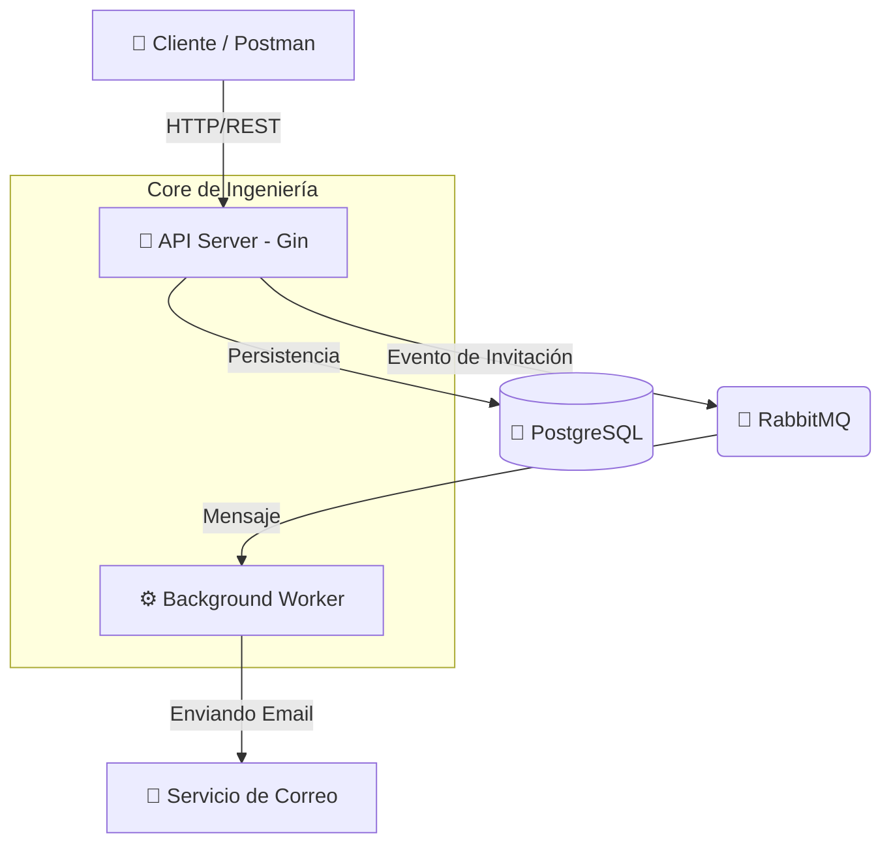

# QuickAttendance - Enterprise Attendance Engine

[](https://golang.org/)
[](LICENSE)
[](https://quickattendance-go-production.up.railway.app/swagger/index.html)

**QuickAttendance** es un motor de gestión de asistencia de nivel empresarial, construido en **Go** y diseñado bajo principios de **Clean Architecture** y **Aislamiento Multi-tenant**. Optimizado para alta escalabilidad, seguridad robusta y procesamiento asíncrono.

---

> [!NOTE]  
> **English version**: Check [README_ENG.md](./README_ENG.md) for documentation in English.

---

## Arquitectura del Sistema

El sistema utiliza un diseño desacoplado donde la API maneja las peticiones críticas y delega tareas pesadas (como notificaciones) a un **Worker** independiente vía **RabbitMQ**.



## Capacidades de Ingeniería

*   **Multi-tenancy Nativo**: Aislamiento lógico de datos a nivel de base de datos. Cada agencia gestiona sus propios usuarios, horarios y asistencias de forma independiente.
*   **Procesamiento Asíncrono**: Uso de RabbitMQ para manejar flujos de invitaciones y notificaciones, asegurando latencias bajas en la API.
*   **Validación de Geofencing**: Las marcas de asistencia remotas validan la ubicación del empleado contra su domicilio registrado mediante cálculos de distancia geodésica.
*   **Security-First**: Implementación de JWT con expiración configurable, Password Hashing con Bcrypt y Middleware de Control de Acceso por Roles (RBAC).
*   **Observabilidad**: Logs estructurados con la librería estándar `slog` de Go, facilitando la integración con stacks de monitoreo modernos.

## Stack Tecnológico

| Componente | Tecnología |
| :--- | :--- |
| **Lenguaje** | Go (Golang) 1.25+ |
| **API Framework** | Gin Gonic |
| **Persistencia** | PostgreSQL + GORM |
| **Broker de Mensajería** | RabbitMQ |
| **Doc interactiva** | Swagger (OpenAPI 3.0) |
| **Containerización** | Docker & Docker Compose |

## Inicio Rápido

1.  **Levantar el ecosistema completo**:
    ```bash
    docker-compose up --build
    ```
    *Esto iniciará: API Server, Background Worker, DB y RabbitMQ.*

2.  **Explorar la API**:
    - **Swagger UI (Live)**: [https://quickattendance-go-production.up.railway.app/swagger/index.html](https://quickattendance-go-production.up.railway.app/swagger/index.html)
    - **Postman**: [Public Collection Link](https://www.postman.com/fco-gt/quickattendance/collection/32287192-4c116f57-2c57-4903-b835-34a4e7911073/)

## Documentación de Ingeniería

- [Guía Paso a Paso de Testing de API](./API_TESTING.md)
- [Diseño del Modelo de Datos](./docs/database_schema.md)
- [Configuración de Despliegue Avanzado (Docker)](./Dockerfile)

---
*Desarrollado como una pieza de ingeniería de software robusta para la gestión de capital humano.*
