# QuickAttendance - Enterprise Attendance Engine

[](https://golang.org/)
[](LICENSE)
[](https://quickattendance-go-production.up.railway.app/swagger/index.html)

**QuickAttendance** is an enterprise-grade attendance management engine, built in **Go** and designed under **Clean Architecture** and **Multi-tenant Isolation** principles. Optimized for high scalability, robust security, and asynchronous processing.

---

> [!NOTE]  
> **Versión en español**: Consulta [README.md](./README.md) para la documentación en español.

---

## System Architecture

The system uses a decoupled design where the API handles critical requests and delegates heavy tasks (such as notifications) to an independent **Worker** via **RabbitMQ**.

```mermaid
graph TD
    Client[📱 Client / Postman] -->|HTTP/REST| API[🚀 API Server - Gin]
    API -->|Persistence| DB[(🐘 PostgreSQL)]
    API -->|Invitation Event| RMQ(🐇 RabbitMQ)
    RMQ -->|Message| Worker[⚙️ Background Worker]
    Worker -->|Sending Email| SMTP[📧 Email Service]
    
    subgraph "Engineering Core"
    API
    Worker
    end
```



## Engineering Capabilities

*   **Native Multi-tenancy**: Database-level logical data isolation. Each agency manages its own users, schedules, and attendance independently.
*   **Asynchronous Processing**: Uses RabbitMQ to handle invitation and notification flows, ensuring low API latency.
*   **Geofencing Validation**: Remote attendance marking validates employee location against their registered address using geodesic distance calculations.
*   **Security-First**: JWT implementation with configurable expiration, Bcrypt password hashing, and Role-Based Access Control (RBAC) middleware.
*   **Observability**: Structured logs using Go's standard `slog` library, facilitating integration with modern monitoring stacks.

## Tech Stack

| Component | Technology |
| :--- | :--- |
| **Language** | Go (Golang) 1.25+ |
| **API Framework** | Gin Gonic |
| **Persistence** | PostgreSQL + GORM |
| **Messaging Broker** | RabbitMQ |
| **Interactive Docs** | Swagger (OpenAPI 3.0) |
| **Containerization** | Docker & Docker Compose |

## Quick Start

1.  **Start the complete ecosystem**:
    ```bash
    docker-compose up --build
    ```
    *This will start: API Server, Background Worker, DB, and RabbitMQ.*

2.  **Explore the API**:
    - **Swagger UI (Live)**: [https://quickattendance-go-production.up.railway.app/swagger/index.html](https://quickattendance-go-production.up.railway.app/swagger/index.html)
    - **Postman**: [Public Collection Link](https://www.postman.com/fco-gt/quickattendance/collection/32287192-4c116f57-2c57-4903-b835-34a4e7911073/)

## Engineering Documentation

- [Step-by-Step API Testing Guide](./API_TESTING_ENG.md)
- [Data Model Design](./docs/database_schema.md)
- [Advanced Deployment Configuration (Docker)](./Dockerfile)

---
*Developed as a robust piece of software engineering for human capital management.*
